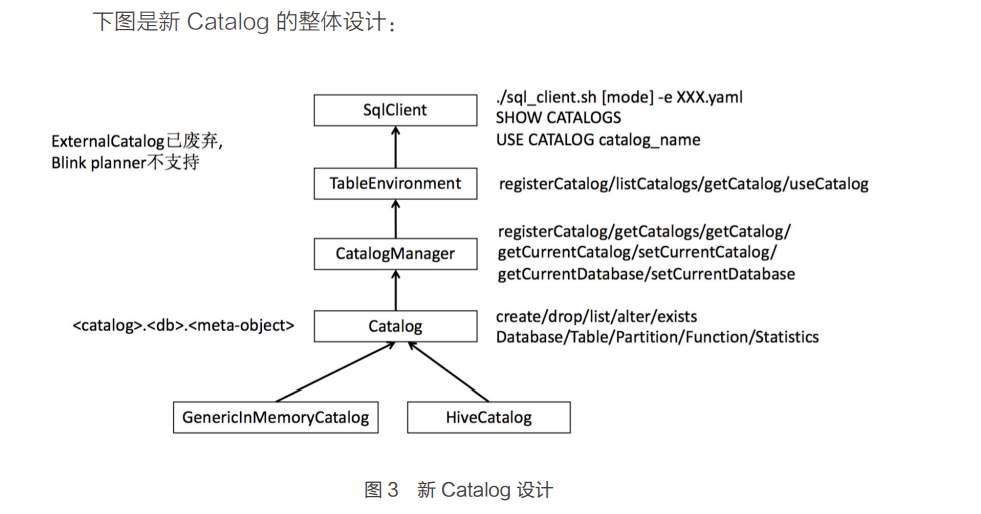

# Flink Catalog

## 概念
什么是catalog

## 设计

> 新的 Catalog 有三层结构（..），最顶层是 Catalog 的名字，中间一
  层是 Database，最底层是各种 MetaObject，如 Table，Partition，Function 等。
  当前，内置了两个 Catalog 实现：MemoryCatalog 和 HiveCatalog。

catalog
- 支持 Create，Drop，List，Alter，Exists 等语句
- 支持对 Database，Table，Partition，Function，Statistics等的操作

CatalogManager 正如它名字一样，主要是用来管理 Catalog。CatalogManager 支持的操作包括：
- 注册 Catalog（registerCatalog）
- 获取所有的 Catalog（getCatalogs）
- 获取特定的 Catalog（getCatalog）
- 获取当前的 Catalog（getCurrentCatalog）
- 设置当前的 Catalog（setCurrentCatalog）
- 获取当前的 Database(getCurrentDatabase)
- 设置当前的 Database(setCurrentDatabase)