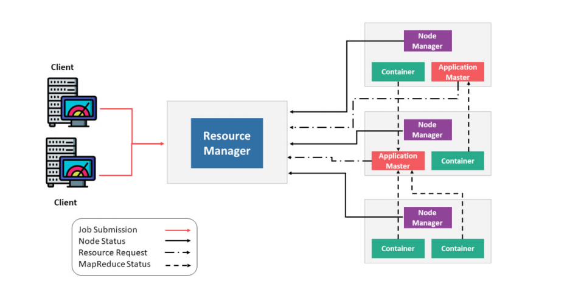
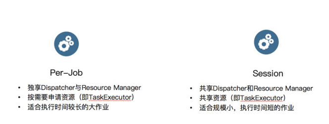
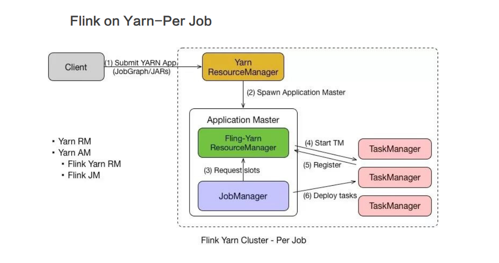
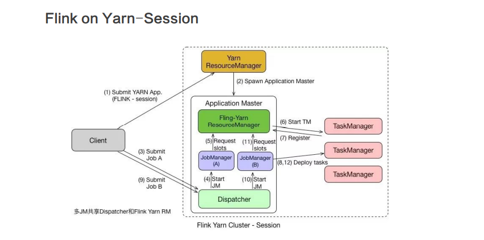

# Flink on Yarn 学习总结

## Yarn 架构原理

### 组件列表
- ResourceManager (RM)：ResourceManager (RM) 负责处理客户端请求、启动 / 监控 ApplicationMaster、监控 NodeManager、资源的分配与调度，包含 Scheduler 和 Applications Manager。
- ApplicationMaster (AM)
- NodeManager (NM)
- Container

## PerJob与Session对比

> Session 模式和 Per Job 模式的应用场景不一样。Per Job 模式比较适合那种
对启动时间不敏感，运行时间较长的任务。Seesion 模式适合短时间运行的任务，一
般是批处理任务。若用 Per Job 模式去运行短时间的任务，那就需要频繁的申请资
源，运行结束后，还需要资源释放，下次还需再重新申请资源才能运行。显然，这种
任务会频繁启停的情况不适用于 Per Job 模式，更适合用 Session 模式。

## Yarn 优缺点

优点:
- 资源的统一管理和调度
- 资源隔离
- 自动 failover 处理

缺点:
- 运维部署成本较高
- 灵活性不够