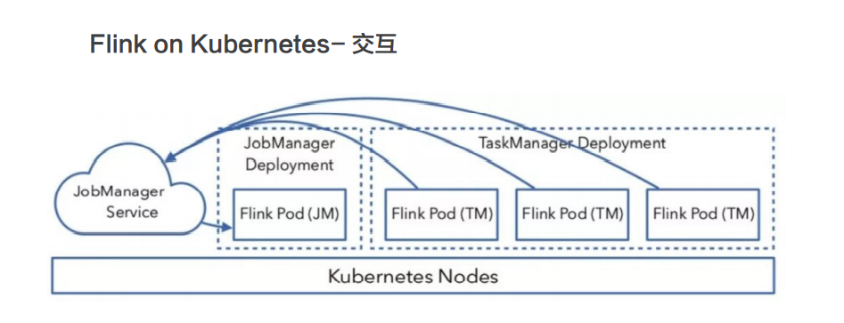

# Flink on k8s

## 详情

> 整个交互的流程比较简单，用户往 Kubernetes 集群提交定义好的资源描述
  文件即可，例如 deployment、configmap、service 等描述。后续的事情就交给
  Kubernetes 集群自动完成。Kubernetes 集群会按照定义好的描述来启动 pod，运行用户程序。各个组件的具体工作如下：

- Service: 通过标签 (label selector) 找到 job manager 的 pod 暴露服务。
- Deployment：保证 n 个副本的 container 运行 JM/TM，应用升级策略。
- ConfigMap：在每个 pod 上通过挂载 /etc/flink 目录，包含 flink-conf.yaml内容。

## QA
Q： Flink 在 K8s 上可以通过 Operator 方式提交任务吗？
> 目前 Flink 官方还没有提供 Operator 的方式，Lyft 公司开源了自己的 Operator 实现：https://github.com/lyft/flinkk8soperator。

Q： 在 K8s 集群上如果不使用 Zookeeper 有没有其他高可用（HA）的方案？
> Etcd 是一个类似于 Zookeeper 的高可用键值服务，目前 Flink 社区正在
考 虑 基 于 Etcd 实 现 高 可 用 的 方 案（https://issues.apache.org/jira/browse/
FLINK-11105）以及直接依赖 K8s API 的方案（https://issues.apache.org/jira/
browse/FLINK-12884）。

Q： Flink on K8s 在任务启动时需要指定 TaskManager 的个数，有和 Yarn
一样的动态资源申请方式吗？
> Flink on K8s 目前的实现在任务启动前就需要确定好 TaskManager 的个数，
这样容易造成 TM 指定太少，任务无法启动，或者指定的太多，造成资源浪费。社区
正在考虑实现和 Yarn 一样的任务启动时动态资源申请的方式。这是一种和 K8s 结
合的更为 Nativey 的方式，称为 Active 模式。Active 意味着 ResourceManager
可以直接向 K8s 集群申请资源。具体设计方案和进展请关注：
https://issues.apache.org/jira/browse/FLINK-9953。