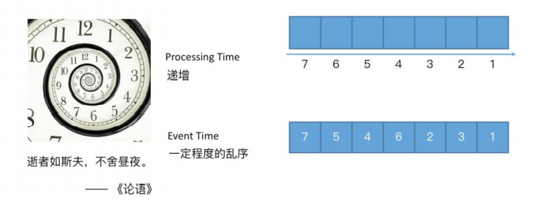
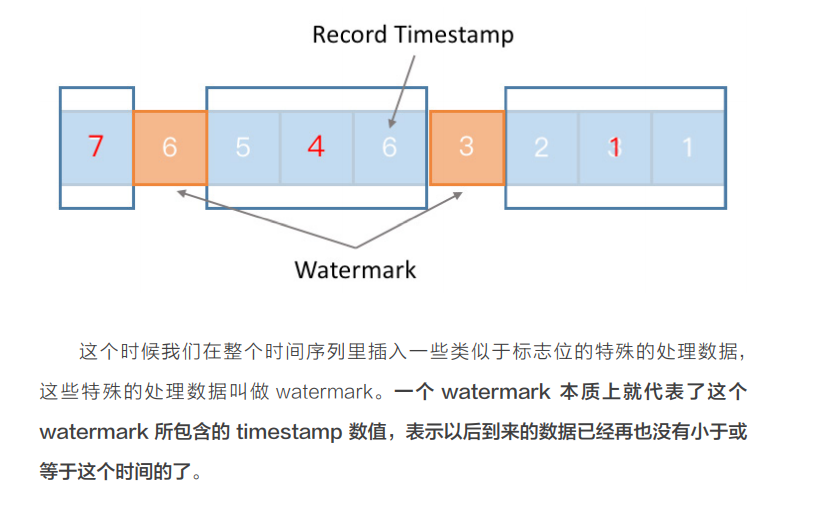

# Flink时间相关

## 基础概念
支持2种时间概念:
-  Processing Time
-  Event Time

当你的应用遇到某些问题要从上一个 checkpoint 或者 savepoint 进行重放，是不是希望结果完全相同。如果希望结果完全相同，就只能用 Event Time；如果接受结果不同，则可以用 Processing Time。

## watermark

Flink 支持两种 watermark 生成方式:

- 在SourceFunction中产生
    -  collectWithTimestamp 方法发送一条数据
        - 第一个参数就是我们要发送的数据
        - 第二个参数就是这个数据所对应的时间戳
    -   emitWatermark 去产生一条 watermark： 表示接下来不会再有时间戳小于等于这个数值记录
- 在使用DataStream API 的时候指定
>  `DataStream.assignTimestampsAndWatermarks` 

建议生成的工作越靠近 DataSource 越好。这样会方便让程序逻辑里面更多的 operator 去判断某些数据是否乱序。