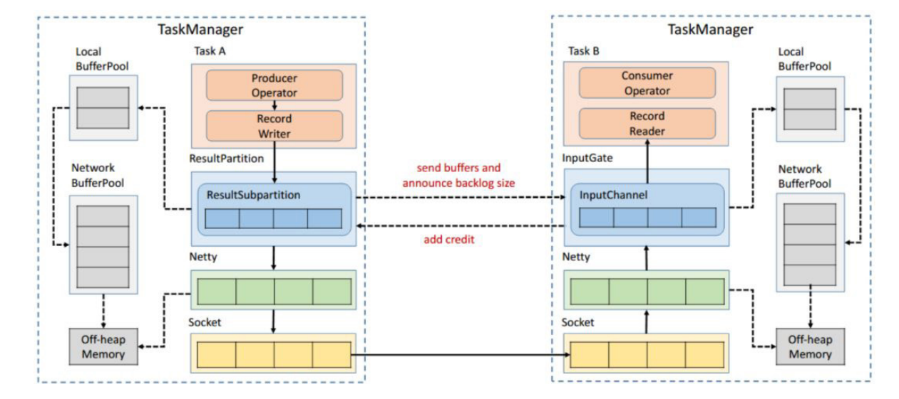
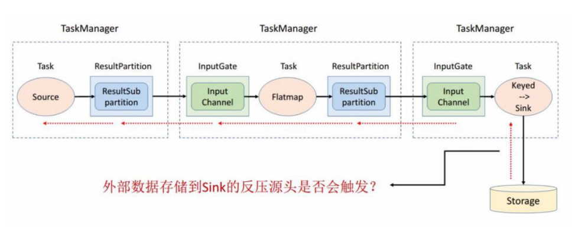

# Flink 反压
## 反压演进

- Flink TCP-based 反压机制（before V1.5）
- Flink Credit-based 反压机制（since V1.5）

> 如图所示在 Flink 层面实现反压机制，就是每一次 ResultSubPartition 向
InputChannel 发送消息的时候都会发送一个 backlog size 告诉下游准备发送多少
消息，下游就会去计算有多少的 Buffer 去接收消息，算完之后如果有充足的 Buffer
就会返还给上游一个 Credit 告知他可以发送消息（图上两个 ResultSubPartition 和
InputChannel 之间是虚线是因为最终还是要通过 Netty 和 Socket 去通信）

## 引申
- 有了动态反压，静态限速是不是完全没有作用了？

> 实际上动态反压不是万能的，我们流计算的结果最终是要输出到一个外部的存
  储（Storage），外部数据存储到 Sink 端的反压是不一定会触发的，这要取决于外
  部存储的实现