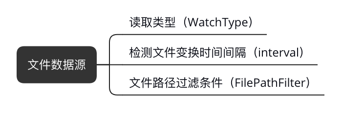
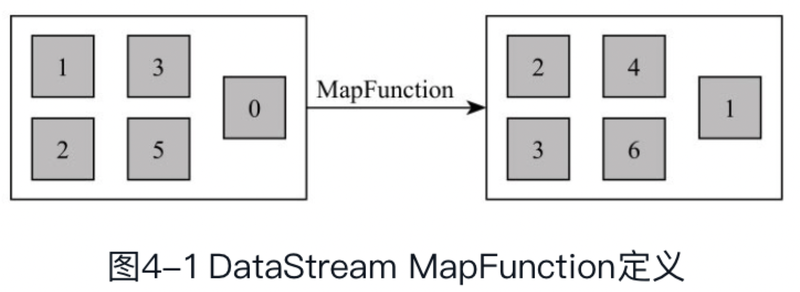
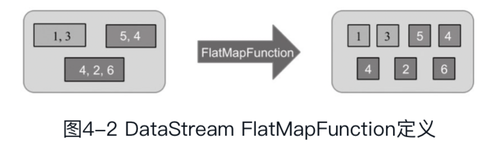
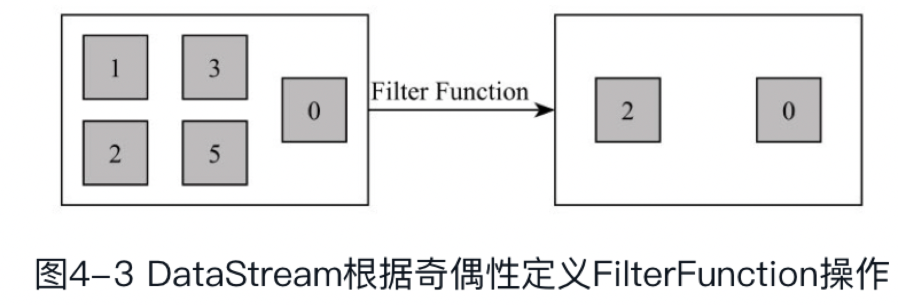
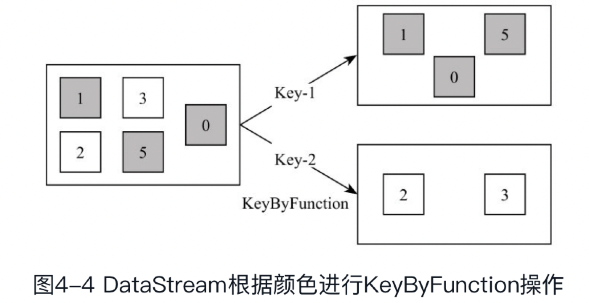
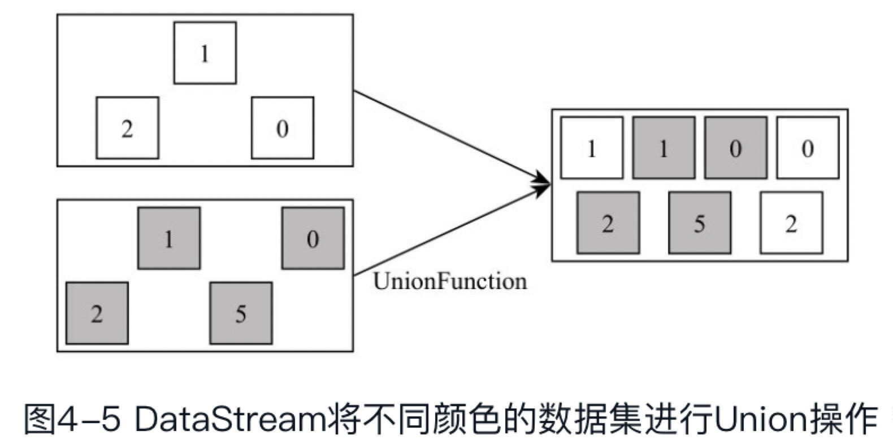
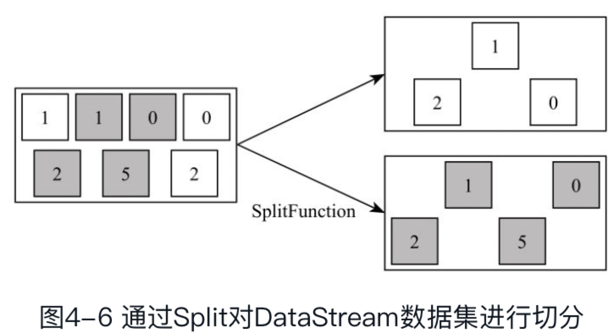

# DataStream API

DataStream API主要可为分为三个部分，DataSource模块、Transformation模块以及DataSink模块。

## 一、DataSource模块

### 内置DataSource

#### 文件数据源:



> 读取类型（WatchType）: 其中WatchType共分为两种模式——PROCESS_CONTINUOUSLY和PROCESS_ONCE模式。在PROCESS_CONTINUOUSLY模式下，一旦检测到文件内容发生变化，Flink会将该文件全部内容加载到Flink系统中进行处理。而在PROCESS_ONCE模式下，当文件内容发生变化时，只会将变化的数据读取至Flink中，在这种情况下数据只会被读取和处理一次


## 二、Transformation模块

所有DataStream的转换操作可分为三类类型:
- 单Single-DataStream
- Multi-DaataStream
- 物理分区

其中Single-DataStream操作定义了对单个DataStream数据集元素的处理逻辑，Multi-DataStream操作定义了对多个DataStream数据集元素的处理逻

### 1、Single-DataStream操作:

#### ```Map [DataStream->DataStream]```


#### ```FlatMap [DataStream->DataStream]```


该算子主要应用处理输入一个元素产生一个或者多个元素的计算场景，比较常见的是在经典例子WordCount中，将每一行的文本数据切割，生成单词序列如在图4-2中对于输入DataStream[String]通过FlatMap函数进行处理，字符串数字按逗号切割，然后形成新的整数数据集。

#### ```Filter [DataStream->DataStream]```


### ```KeyBy [DataStream->KeyedStream]```


以下两种数据类型将不能使用KeyBy方法对数据集进行重分区：

1. 用户使用POJOs类型数据，但是POJOs类中没有复写hashCode()方法，而是依赖于Object.hasCode();
2. 任何数据类型的数组结构。

### ```Reduce [KeyedStream->DataStream]```

主要目的是将输入的KeyedStream通过传入的用户自定义的ReduceFunction滚动地进行数据聚合处理，其中定义的ReduceFunciton必须满足运算结合律和交换律。

### ```Aggregations[KeyedStream->DataStream]```

Aggregations是DataStream接口提供的聚合算子，根据指定的字段进行聚合操作，滚动地产生一系列数据聚合结果。其实是将Reduce算子中的函数进行了封装，封装的聚合操作有sum、min、minBy、max、maxBy等，这样就不需要用户自己定义Reduce函数

## Multi-DataStream操作

#### ```Union[DataStream ->DataStream]```


### ```Connect, CoMap,CoFlatMap[DataStream ->DataStream]```
Connect算子主要是为了合并两种或者多种不同数据类型的数据集，合并后会保留原来数据集的数据类型。

### ```Split [DataStream->SplitStream]```


Split算子是将一个DataStream数据集按照条件进行拆分，形成两个数据集的过程，也是union算子的逆向实现。每个接入的数据都会被路由到一个或者多个输出数据集中。如图4-6所示，将输入数据集根据颜色切分成两个数据集。

### ```Select [SplitStream ->DataStream]```
split函数本身只是对输入数据集进行标记，并没有将数据集真正的实现切分，因此需要借助Select函数根据标记将数据切分成不同的数据集。

### ```Iterate[DataStream->IterativeStream->DataStream]```
Iterate算子适合于迭代计算场景

## 物理分区（Physical Partitioning
- 随机分区（Random Partitioning）: ```[DataStream ->DataStream]```
- Roundrobin Partitioning: ```[DataStream ->DataStream]```
- Rescaling Partitioning: ```[DataStream ->DataStream]```
- 广播操作（Broadcasting）: ```[DataStream ->DataStream]```
- 自定义分区（Custom Partitioning）: ```[DataStream ->DataStream]```

# 三、DataSink模块

todo